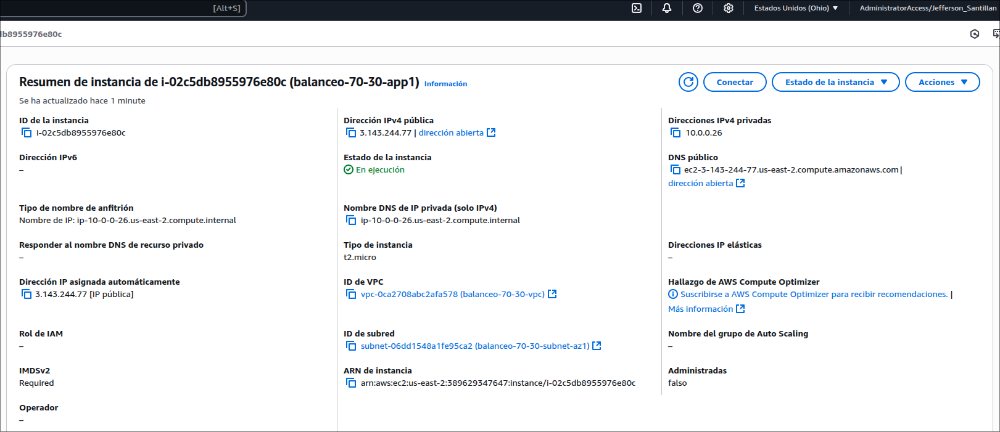
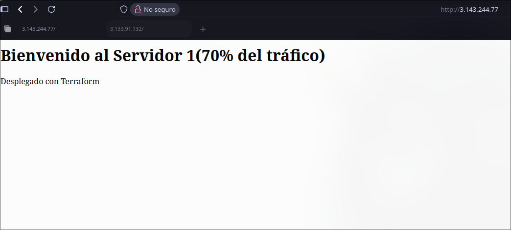
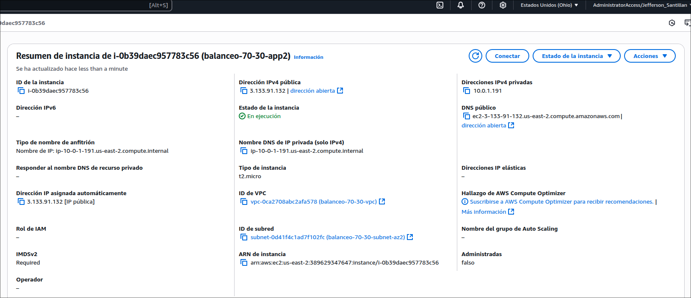
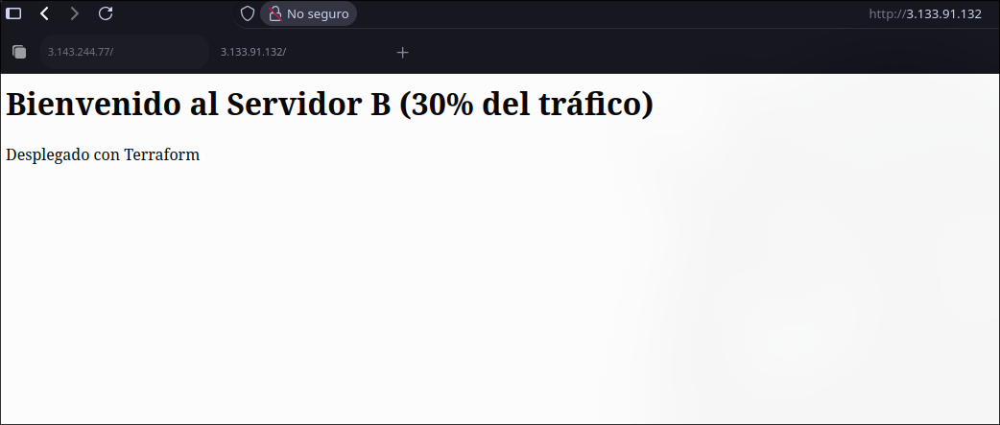
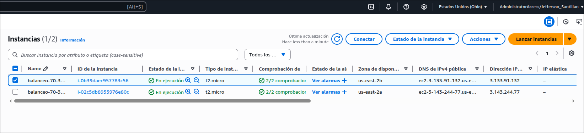

# Laboratorio 10: Balanceador de Carga AWS con Terraform

Este proyecto implementa una infraestructura en AWS utilizando Terraform que despliega un sistema de balanceo de carga con distribución de tráfico 70/30 entre dos aplicaciones.

## Arquitectura

La infraestructura incluye:
- VPC con 2 subredes en diferentes zonas de disponibilidad
- Application Load Balancer (ALB)
- 2 instancias EC2 con diferentes aplicaciones
- Grupos de seguridad para ALB y EC2
- Configuración de balanceo de tráfico 70/30

## Capturas de Pantalla

### Aplicación 1 (70% del tráfico)
Detalles aplicación 1:


Vista en Firefox:


### Aplicación 2 (30% del tráfico)
Detalles aplicación 2:


Vista en Firefox:


### Infraestructura AWS
Vista de las instancias en la Consola AWS:


## Prerrequisitos

- Terraform v1.0.0 o superior
- AWS CLI configurado con credenciales válidas
- Par de claves AWS (Key Pair) creado

## Configuración de Variables

1. Edite `terraform.tfvars` y configure los valores según su entorno:
- `aws_region`: Región de AWS donde se desplegarán los recursos
- `project_name`: Nombre base para identificar los recursos
- `key_name`: Nombre de su par de claves AWS
- `ami_id`: ID de la AMI que desea utilizar
- Otros valores según necesite personalizar

## Estructura del Proyecto

```
.
├── main.tf                 # Configuración principal de Terraform
├── variables.tf            # Definición de variables
├── network.tf              # Configuración de VPC y networking
├── security_groups.tf      # Grupos de seguridad
├── ec2.tf                 # Configuración de instancias EC2
├── alb.tf                 # Configuración del Application Load Balancer
├── outputs.tf             # Outputs del proyecto
├── terraform.tfvars.example # Ejemplo de variables
├── scripts/               # Scripts de inicialización
│   ├── app1.sh           # Script para la primera aplicación
│   └── app2.sh           # Script para la segunda aplicación
└── README.md             # Este archivo
```

## Despliegue

1. Inicializar Terraform:
```bash
terraform init
```

2. Revisar el plan de ejecución:
```bash
terraform plan
```

3. Aplicar la configuración:
```bash
terraform apply
```

4. Para destruir la infraestructura:
```bash
terraform destroy
```

## Outputs

Después del despliegue, Terraform mostrará:
- URL del balanceador de carga
- IPs públicas de las instancias EC2

## Configuración del Balanceo

El balanceador está configurado para distribuir el tráfico:
- 70% hacia la aplicación 1
- 30% hacia la aplicación 2

## Seguridad

Los grupos de seguridad están configurados para:
- ALB: Acepta tráfico HTTP (80) desde cualquier origen
- EC2: Acepta tráfico HTTP (80) solo desde el ALB
```

## Consideraciones

- Las instancias se despliegan en diferentes zonas de disponibilidad para alta disponibilidad
- Los health checks están configurados para verificar el endpoint "/" cada 30 segundos
- La protección contra eliminación del ALB está deshabilitada para entornos de desarrollo

